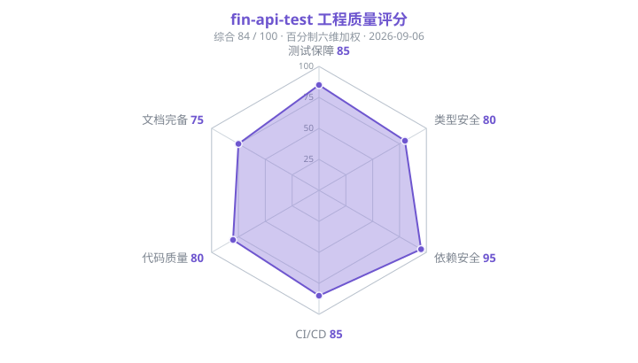

# 工程质量评分卡

> **文档版本**:v1.0
> **评分日期**:2026-09-06
> **基准提交**:`c9d0e56`（main）
> **评分对象**:fin-api-test 全仓库（测试平台前后端 + 根目录五层用例工程）
> **维护说明**:每次质量专项改进后追加一轮记录,评分依据须为可验证的客观证据(CI 结果、测试计数、扫描报告)。

---

## 1. 综合得分

**84 / 100**(百分制六维加权)

```
综合分 = Σ(维度得分 × 维度权重)
       = 85×0.20 + 80×0.15 + 95×0.15 + 85×0.20 + 80×0.20 + 75×0.10
       = 83.75 ≈ 84
```

## 2. 评分雷达图



## 3. 六维评分明细

| 维度 | 权重 | 得分 | 加权分 | 评分依据 |
|---|---|---|---|---|
| 测试保障 | 20% | 85 | 17.0 | 后端 pytest 734 通过(37 个测试文件),前端 vitest 72 通过(7 个套件),均已纳入双平台 CI 强制卡点 |
| 类型安全 | 15% | 80 | 12.0 | 后端 mypy 0 错误(58 源文件,SQLAlchemy 2.0 插件,Basic 档严格配置),前端 vue-tsc --noEmit 零错误;CI 中 mypy job 暂为 advisory 模式 |
| 依赖安全 | 15% | 95 | 14.25 | GitHub Dependabot 开放告警 0(此前 6 个:1 critical / 2 high / 3 moderate 已全部修复);SQLAlchemy 升级 2.0.52 修复 Python 3.14 兼容缺陷 |
| CI/CD | 20% | 85 | 17.0 | GitHub Actions 5 job 全绿(ruff / pytest / mypy / vue-tsc+build / vitest),GitLab CI 同步运行,pre-commit 本地钩子(ruff、mypy、vue-tsc、vitest、YAML/JSON 校验) |
| 代码质量 | 20% | 80 | 16.0 | ruff(pyflakes F)零告警;ORM 全量迁移至 SQLAlchemy 2.0 类型化 `mapped_column` 写法;19,018 行 Python / 143 文件结构清晰,分层(routers/services/crud/engine)一致 |
| 文档完备 | 10% | 75 | 7.5 | `docs/SYSTEM_DESIGN.md`(系统设计)+ `docs/CONTEXT.md`(项目上下文)+ 根 README;暂缺 API 参考文档与部署运维手册 |

## 4. 证据快照(2026-09-06)

| 指标 | 数值 | 来源 |
|---|---|---|
| 后端测试 | 734 passed | `pytest tests -q`(本地)+ GitHub Actions `Backend Tests` job |
| 前端测试 | 72 passed / 7 files | `npm run test` + GitHub Actions `Frontend Unit Tests` job |
| mypy 错误 | 0(此前基线 301) | `mypy app`,GitHub Actions `Backend Type Check` job |
| vue-tsc 错误 | 0 | GitHub Actions `Frontend Typecheck & Build` job |
| Dependabot 开放告警 | 0(此前 6) | GitHub Security Advisories API 实时查询 |
| Python 规模 | 143 文件 / 19,018 行 | `git ls-files "*.py"` |
| CI 状态 | 5/5 job success | commit `c9d0e56` check-runs |

## 5. 提升路线(下一轮目标 ≥ 90)

1. **mypy 转 blocking**:基线已清零,将 CI 中 `continue-on-error: true` 移除,防止回归(类型安全 → 90)。
2. **覆盖率量化**:接入 `pytest-cov` / `vitest --coverage`,在后端 services/engine 层建立行覆盖率基线并纳入报告(测试保障 → 92)。
3. **API 文档**:FastAPI 自带 OpenAPI schema 导出为 Markdown/引用文档,补齐 docs/(文档完备 → 85)。
4. **前端组件测试**:当前 vitest 覆盖 utils 层,可扩展到核心组件(命令面板、用例编排画布)的挂载交互测试。
