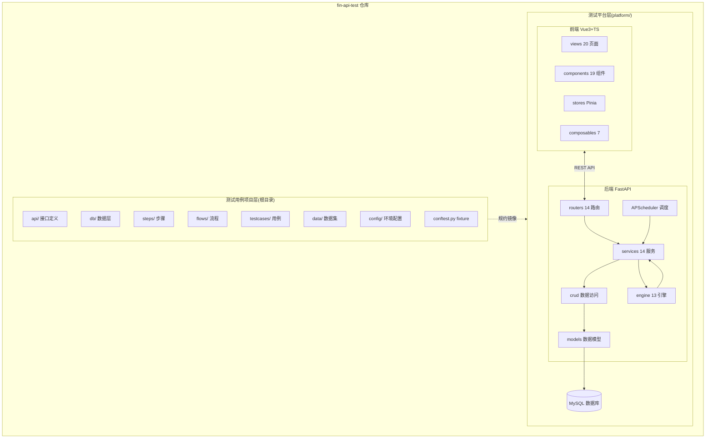
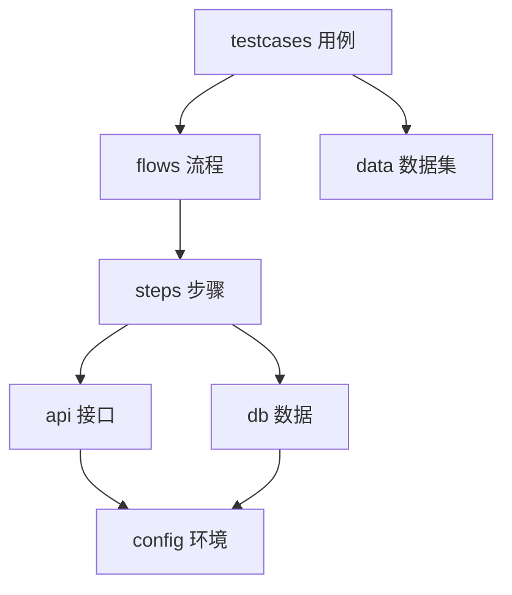
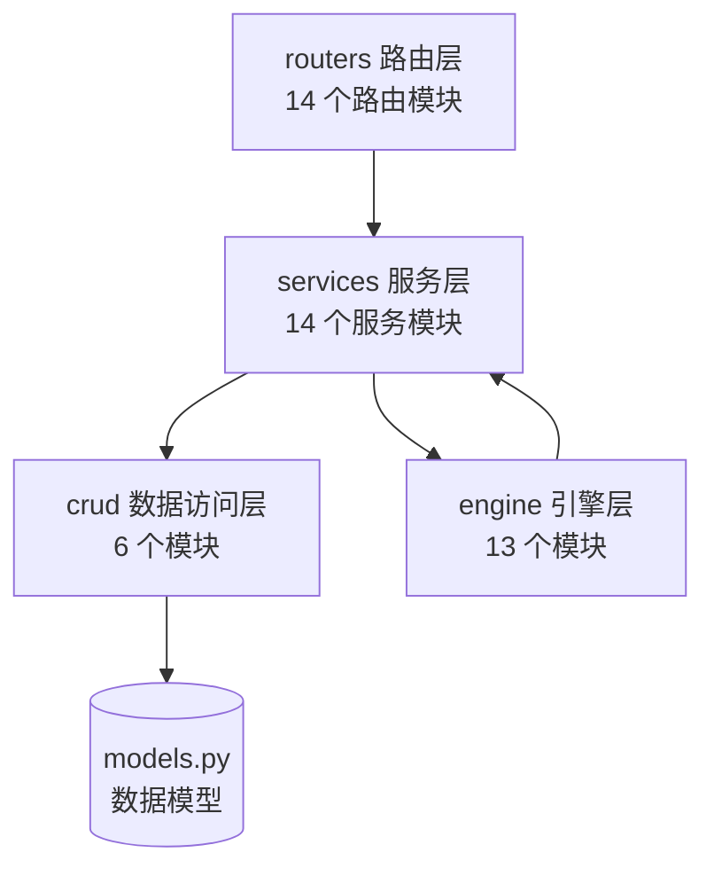
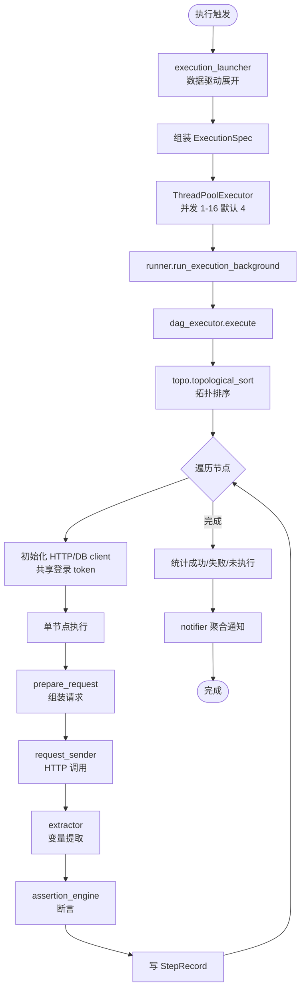
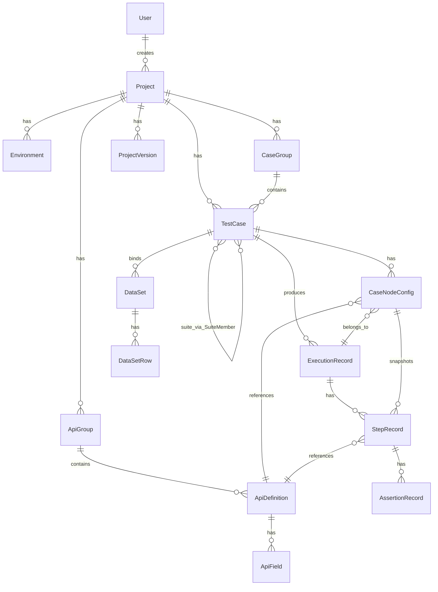
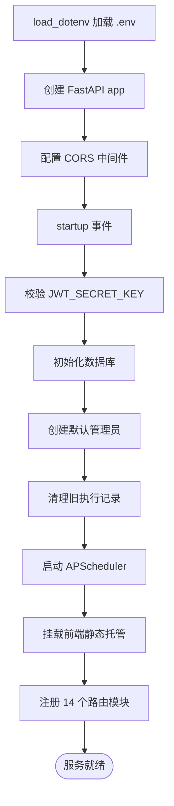

# 系统设计文档

> **文档版本**:v1.0
> **更新日期**:2026-09-06
> **适用代码**:fin-api-test
> **维护说明**:本文档与代码实现同步,架构变更需同步更新本文档。差异以代码为准。

---

## 目录

1. [概述](#1-概述)
2. [整体架构](#2-整体架构)
3. [测试用例项目层(根目录五层架构)](#3-测试用例项目层根目录五层架构)
4. [测试平台 - 后端](#4-测试平台---后端)
5. [测试平台 - 前端](#5-测试平台---前端)
6. [核心机制](#6-核心机制)
7. [数据模型](#7-数据模型)
8. [配置与部署](#8-配置与部署)
9. [安全设计](#9-安全设计)
10. [设计决策与非功能性约束](#10-设计决策与非功能性约束)

---

## 1. 概述

### 1.1 项目定位

fin-api-test 是一个 **API 接口自动化测试平台**,面向接口回归测试、数据驱动测试、流程编排测试场景,提供从接口定义、用例编排、数据集管理、定时调度、执行追踪到报告导出的端到端能力。

### 1.2 核心创新:双层同构架构

本项目最显著的设计特征是 **双层同构架构**——同一仓库内同时承载两个层次:

| 层次 | 位置 | 角色 |
|---|---|---|
| **测试用例项目层** | 仓库根目录 `api/db/steps/flows/testcases/data` | 按"五层同构规约"组织的可执行 pytest 用例集合,本身即是被测对象的最佳实践示例 |
| **测试平台层** | `platform/backend` + `platform/frontend` | 一套完整的 Web 平台,提供可视化用例编排、执行调度、报告管理等能力 |

两个层次共享同一套"五层同构"概念模型:接口定义(api)、数据层(db)、步骤(steps)、流程(flows)、用例(testcases)、数据(data)。平台的数据库模型与根目录的目录规约互为镜像,使得"用平台管理用例"与"手写 pytest 用例"在概念上完全一致。

### 1.3 适用读者

- 后端/前端开发者:理解分层、模块边界、核心机制
- 测试工程师:理解用例编排、执行链路、变量与断言
- 运维:理解部署架构、配置项、CI/CD 流水线

---

## 2. 整体架构

### 2.1 架构总览



### 2.2 技术栈

| 层 | 技术选型 |
|---|---|
| 后端框架 | FastAPI + Uvicorn |
| ORM | SQLAlchemy + Alembic(19 个迁移版本) |
| 数据库 | MySQL(PyMySQL 驱动,charset=utf8mb4,连接池) |
| 数据校验 | Pydantic |
| 调度 | APScheduler(BackgroundScheduler) |
| HTTP 客户端 | requests(15s 超时,finally 关闭会话) |
| 认证 | HMAC-SHA256 自签名 token(7 天有效期) |
| 前端框架 | Vue 3 Composition API + `<script setup>` |
| 状态管理 | Pinia |
| UI 库 | Element Plus |
| DAG 可视化 | @vue-flow/core(VueFlow) |
| 构建工具 | Vite |
| 类型检查 | TypeScript 严格模式 + vue-tsc |
| Lint | ruff(后端)、vue-tsc(前端) |
| CI/CD | GitHub Actions + GitLab CI、pre-commit |
| 容器化 | Docker(Python 3.12 slim + Node 构建) |
| 部署 | Render 云 / systemd 自建 |

---

## 3. 测试用例项目层(根目录五层架构)

### 3.1 五层同构规约

根目录按以下五层规约组织,每一层职责单一、层间依赖单向向下:

```
fin-api-test/
├── api/          # 接口定义层:接口基础类、接口封装
├── db/           # 数据层:数据库操作封装
├── steps/        # 步骤层:单接口操作 + 校验
├── flows/        # 流程层:多步骤业务流程编排
├── testcases/    # 用例层:pytest 测试函数,组合 flows
├── data/         # 数据集层:数据驱动测试数据
├── config/       # 环境配置:env_*.yaml 环境定义
├── conftest.py   # pytest fixture:env_config/api_factory/login_token
└── pytest.ini    # pytest 配置
```

层间依赖规则:



### 3.2 fixture 体系(conftest.py)

根目录 [conftest.py](file:///d:/CODE/PyCharm/pythonProject/fin-api-test/conftest.py) 提供以下 session 级 fixture:

| Fixture | 作用域 | 职责 |
|---|---|---|
| `env_config` | session | 加载 `config/env_*.yaml`,提供环境配置(base_url、公共请求头、db_config) |
| `api_factory` | session | 根据 env_config 构造接口对象工厂 |
| `login_token` | session | 执行登录获取 token,注入到公共请求头 |
| `auto_login` | session | 自动登录装饰器,失败跳过用例 |
| `db_factory` | session | 根据 db_config 构造数据库客户端 |

### 3.3 环境配置(config/env_*.yaml)

参考 [config/env_demo.yaml](file:///d:/CODE/PyCharm/pythonProject/fin-api-test/config/env_demo.yaml):

```yaml
env_name: demo
base_url: https://api.example.com
common_headers:
  Content-Type: application/json
mysql:
  host: 127.0.0.1
  port: 3306
  user: root
  password: "***"
  database: test_db
  charset: utf8mb4
```

### 3.4 运行机制

- pytest 按 `pytest.ini` 配置从 `testcases/` 收集用例
- 支持按 marker 过滤执行(冒烟、回归等)
- 生成 HTML 报告

---

## 4. 测试平台 - 后端

后端位于 `platform/backend/app/`,采用经典四层分层架构。

### 4.1 分层架构



**层间依赖规则**:
- 路由层只依赖服务层,不直接访问数据库
- 服务层编排 crud 与 engine,封装业务逻辑
- 数据访问层只做单表 CRUD,不含业务规则
- 引擎层是无状态算法模块,被服务层调用

### 4.2 路由层(routers/)

14 个路由模块,统一在 [main.py](file:///d:/CODE/PyCharm/pythonProject/fin-api-test/platform/backend/app/main.py) 注册:

| 模块 | 路径前缀 | 职责 |
|---|---|---|
| `auth.py` | `/api/auth` | 登录、登出、改密、当前用户 |
| `users.py` | `/api/users` | 用户 CRUD、头像、重置密码 |
| `projects.py` | `/api/projects` | 项目 CRUD、项目切换 |
| `environments.py` | `/api/environments` | 环境 CRUD、连接测试、token 缓存清理 |
| `apis.py` | `/api/apis` | 接口定义 CRUD、分组、批量移动、复制、导出 |
| `testcases.py` | `/api/testcases` | 用例 CRUD、套件、数据集绑定、定时任务清理 |
| `datasets.py` | `/api/datasets` | 数据集 CRUD、行级管理、Excel/CSV 导入导出、合并预览 |
| `executions.py` | `/api/executions` | 单用例执行、批量执行、执行详情查询 |
| `schedules.py` | `/api/schedules` | 定时任务 CRUD、立即执行 |
| `reports.py` | `/api/reports` | 报告查询、CSV/HTML 导出 |
| `versions.py` | `/api/versions` | 项目版本快照、回滚 |
| `field_dictionaries.py` | `/api/field-dictionaries` | 字段字典管理 |
| `files.py` | `/api/files` | 文件上传下载中心 |
| `operation_logs.py` | `/api/operation-logs` | 操作日志审计 |

### 4.3 引擎层(engine/)

13 个无状态算法模块,是平台的核心:

| 模块 | 职责 |
|---|---|
| [dag_executor.py](file:///d:/CODE/PyCharm/pythonProject/fin-api-test/platform/backend/app/engine/dag_executor.py) | DAG 执行主流程:拓扑排序、逐节点执行、统计、写记录、通知 |
| [runner.py](file:///d:/CODE/PyCharm/pythonProject/fin-api-test/platform/backend/app/engine/runner.py) | 用例执行入口:创建执行记录、加载 TestCase/Environment、套件分流、线程池提交 |
| [topo.py](file:///d:/CODE/PyCharm/pythonProject/fin-api-test/platform/backend/app/engine/topo.py) | DAG 拓扑排序:入度法,按节点 ID 字典序稳定执行 |
| [prepare_request.py](file:///d:/CODE/PyCharm/pythonProject/fin-api-test/platform/backend/app/engine/prepare_request.py) | 请求体组装:字段优先级、`${}` 求值、前置处理、类型强转、文件剥离 |
| [expression.py](file:///d:/CODE/PyCharm/pythonProject/fin-api-test/platform/backend/app/engine/expression.py) | `${}` 表达式求值:变量、env、global、db、内置函数、时间、UUID |
| [context.py](file:///d:/CODE/PyCharm/pythonProject/fin-api-test/platform/backend/app/engine/context.py) | 变量上下文:环境变量、数据行变量、提取变量统一池 |
| [assertion_engine.py](file:///d:/CODE/PyCharm/pythonProject/fin-api-test/platform/backend/app/engine/assertion_engine.py) | 断言引擎:JSONPath、HTTP 状态码、响应时间、DB 查询、DB-vs-JSONPath(17 种) |
| [extractor.py](file:///d:/CODE/PyCharm/pythonProject/fin-api-test/platform/backend/app/engine/extractor.py) | 变量提取:响应 JSONPath、数据库 SQL,支持后续规则引用已提取变量 |
| [preprocessor.py](file:///d:/CODE/PyCharm/pythonProject/fin-api-test/platform/backend/app/engine/preprocessor.py) | 前置处理:set_field 覆盖、计算字段 |
| [type_coercer.py](file:///d:/CODE/PyCharm/pythonProject/fin-api-test/platform/backend/app/engine/type_coercer.py) | 类型强转:按 ApiField 声明类型转换最终值 |
| [events.py](file:///d:/CODE/PyCharm/pythonProject/fin-api-test/platform/backend/app/engine/events.py) | 执行事件:用于解耦的回调钩子 |
| [curl_parser.py](file:///d:/CODE/PyCharm/pythonProject/fin-api-test/platform/backend/app/engine/curl_parser.py) | cURL 命令解析:从 cURL 导入接口定义 |
| [har_parser.py](file:///d:/CODE/PyCharm/pythonProject/fin-api-test/platform/backend/app/engine/har_parser.py) | HAR 文件解析:从浏览器录制导入接口定义 |

### 4.4 服务层(services/)

14 个服务模块,封装业务编排逻辑:

| 模块 | 职责 |
|---|---|
| [execution_launcher.py](file:///d:/CODE/PyCharm/pythonProject/fin-api-test/platform/backend/app/services/execution_launcher.py) | 执行编排核心:数据驱动展开、创建执行记录、组装 ExecutionSpec、批量提交线程池、通知聚合 |
| [suite_executor.py](file:///d:/CODE/PyCharm/pythonProject/fin-api-test/platform/backend/app/services/suite_executor.py) | 套件执行:跨项目用例组合执行 |
| [case_combine_service.py](file:///d:/CODE/PyCharm/pythonProject/fin-api-test/platform/backend/app/services/case_combine_service.py) | 组合用例服务 |
| [scheduler.py](file:///d:/CODE/PyCharm/pythonProject/fin-api-test/platform/backend/app/services/scheduler.py) | APScheduler 调度:TestSchedule 转 job、重叠保护、错过不补跑、孤儿清理 |
| [token_cache.py](file:///d:/CODE/PyCharm/pythonProject/fin-api-test/platform/backend/app/services/token_cache.py) | 共享 token 缓存:线程安全 login_shared/refresh_shared/invalidate |
| [runtime_service.py](file:///d:/CODE/PyCharm/pythonProject/fin-api-test/platform/backend/app/services/runtime_service.py) | 运行时服务:登录流程、token_share_mode、验证码登录、刷新回调 |
| [body_builder.py](file:///d:/CODE/PyCharm/pythonProject/fin-api-test/platform/backend/app/services/body_builder.py) | 请求体默认值组装:按 ApiField 生成、嵌套路径、数组请求体、模板回退、行值覆盖 |
| [request_sender.py](file:///d:/CODE/PyCharm/pythonProject/fin-api-test/platform/backend/app/services/request_sender.py) | 实际 HTTP 调用:GET/POST/multipart/form-urlencoded、异常分类、响应处理 |
| [dataset_service.py](file:///d:/CODE/PyCharm/pythonProject/fin-api-test/platform/backend/app/services/dataset_service.py) | 数据集服务:展开、行值合并预览 |
| [report_export.py](file:///d:/CODE/PyCharm/pythonProject/fin-api-test/platform/backend/app/services/report_export.py) | 报告导出:CSV/HTML 格式 |
| [export_service.py](file:///d:/CODE/PyCharm/pythonProject/fin-api-test/platform/backend/app/services/export_service.py) | 通用导出服务 |
| [spec_parser.py](file:///d:/CODE/PyCharm/pythonProject/fin-api-test/platform/backend/app/services/spec_parser.py) | OpenAPI/Swagger 解析:跳过 header 参数、query/path/cookie 需默认值、body 全量导入 |
| [file_helpers.py](file:///d:/CODE/PyCharm/pythonProject/fin-api-test/platform/backend/app/services/file_helpers.py) | 文件辅助 |
| [notifier.py](file:///d:/CODE/PyCharm/pythonProject/fin-api-test/platform/backend/app/services/notifier.py) | 通知服务:执行完成后聚合通知 |

### 4.5 数据访问层(crud/)

6 个模块,只做单表 CRUD,不含业务规则:`auth.py`、`datasets.py`、`executions.py`、`users.py`、`versions.py`、`legacy.py`。

---

## 5. 测试平台 - 前端

前端位于 `platform/frontend/src/`,Vue 3 Composition API + `<script setup>` + TypeScript 严格模式。

### 5.1 目录结构

```
platform/frontend/src/
├── api/            # axios 封装 + 拦截器
├── components/     # 19 个通用组件
├── composables/    # 7 个组合式函数
├── layouts/        # 布局
├── router/         # 路由 + 守卫
├── stores/         # Pinia(index + tabs)
├── types/          # 类型定义
├── utils/          # 工具函数
└── views/          # 20 个页面
```

### 5.2 路由与页面

完整路由见 [router/index.ts](file:///d:/CODE/PyCharm/pythonProject/fin-api-test/platform/frontend/src/router/index.ts),主要页面:

| 页面 | 文件 | 职责 |
|---|---|---|
| 登录 | `Login.vue` | 账号密码登录 |
| 首页 | `Home.vue` | 仪表盘 |
| 项目管理 | `ProjectManage.vue` | 项目 CRUD |
| 接口管理 | `ApiManage.vue` | 接口列表 |
| 接口编辑 | `ApiEdit.vue` | 接口字段配置 |
| 用例列表 | `CaseList.vue` | 用例 CRUD |
| 用例编排 | `CaseDesigner.vue` | DAG 可视化编排 |
| 套件编排 | `SuiteDesigner.vue` | 跨项目用例组合 |
| 数据集 | `DatasetManage.vue` | 数据集行级管理 |
| 环境管理 | `EnvManage.vue` / `EnvEdit.vue` | 环境配置 |
| 执行记录 | `Execution.vue` | 执行详情、步骤展开 |
| 报告详情 | `ReportDetail.vue` / `SuiteReportDetail.vue` | 报告、CSV/HTML 导出 |
| 用户管理 | `UserManage.vue` | 用户 CRUD |
| 操作日志 | `OperationLog.vue` | 审计日志 |
| 文件中心 | `FileCenter.vue` | 文件上传下载 |
| 字典管理 | `DictManage.vue` | 字段字典 |

路由守卫:未登录跳转登录页、首次登录强制改密、管理员权限校验、动态页面标题。

### 5.3 状态管理(Pinia)

| Store | 职责 |
|---|---|
| [stores/index.ts](file:///d:/CODE/PyCharm/pythonProject/fin-api-test/platform/frontend/src/stores/index.ts) | 主应用 store:项目、环境、当前项目/环境、用户、字段字典、主题、登录/登出 |
| [stores/tabs.ts](file:///d:/CODE/PyCharm/pythonProject/fin-api-test/platform/frontend/src/stores/tabs.ts) | 标签页管理:已打开页面、激活标签、关闭/左右关闭,配合 keep-alive |

### 5.4 API 封装层

[api/index.ts](file:///d:/CODE/PyCharm/pythonProject/fin-api-test/platform/frontend/src/api/index.ts):
- 基地址 `/api`,60s 超时
- `paramsSerializer`:数组参数序列化为重复 key,适配 FastAPI List Query
- 请求拦截:注入 `Authorization: Bearer <token>`、启动顶部进度条
- 响应拦截:401 清 token 跳登录、blob 错误解析、统一 `ApiError`、支持 silent 轮询

### 5.5 DAG 可视化编辑器

[DagCanvas.vue](file:///d:/CODE/PyCharm/pythonProject/fin-api-test/platform/frontend/src/components/DagCanvas.vue) 基于 `@vue-flow/core` 的 VueFlow:
- 节点/连线交互、连接点、方法色签、配置徽标
- 连线模式、节点选择/删除/打开配置、复制/粘贴、键盘快捷键
- 通过 `v-model:nodes/edges` 与父组件 [CaseDesigner.vue](file:///d:/CODE/PyCharm/pythonProject/fin-api-test/platform/frontend/src/views/CaseDesigner.vue) 双向绑定

### 5.6 组合式函数(composables/)

| 函数 | 职责 |
|---|---|
| `useExecutionRunner.ts` | 执行结果轮询:定时请求直到终态或达最大次数、favicon 三态、结果提示 |
| `useFaviconStatus.ts` | favicon 三态(running/pass/fail) |
| `useClientSort.ts` | 客户端排序 |
| `useFieldDict.ts` | 字段字典 |
| `useGroupedTable.ts` | 分组表格 |
| `useGroupMasterDetail.ts` | 主从分组 |
| `useGroupTree.ts` | 分组树 |

### 5.7 通用组件(components/)

核心组件:`DagCanvas`(DAG 画布)、`NodeConfigDrawer`(节点配置抽屉)、`FieldTable`/`KeyValueTable`/`AssertionTable`/`PreProcessTable`/`PostExtractTable`(配置表格)、`BatchRunDialog`/`DataDrivenRunDialog`(执行对话框)、`ScheduleDialog`(定时任务)、`ProjectVersionHistory`(版本历史)、`StepTrendChart`(趋势图)、`AvatarCropper`(头像裁剪)、`CommandPalette`(命令面板)。

---

## 6. 核心机制

### 6.1 DAG 执行引擎



关键实现:[dag_executor.py](file:///d:/CODE/PyCharm/pythonProject/fin-api-test/platform/backend/app/engine/dag_executor.py)
- 拓扑排序按节点 ID 字典序稳定执行
- 失败节点后续节点标记为"未执行"
- 每节点写一条 StepRecord,含请求/响应、耗时、前置/后置、提取变量、断言结果

### 6.2 请求体字段值优先级

参考 [prepare_request.py](file:///d:/CODE/PyCharm/pythonProject/fin-api-test/platform/backend/app/engine/prepare_request.py):

**优先级(高到低)**:
1. **数据集行值**(dataset row values)
2. **用例前置处理 set_field**(pre_process)
3. **接口字段默认值**(ApiField defaults)

**执行顺序**:
```
接口默认值组装(body_builder)
  → 数据集行值覆盖(apply_row_overrides,只覆盖已存在字段,跳过动态 ${} 字段与空值)
  → ${} 求值(第一轮)
  → 前置处理 set_field
  → ${} 求值(第二轮)
  → JSON 字符串还原
  → 字段类型强转(type_coercer)
  → 文件字段剥离
  → headers 表达式求值
```

**注意**:环境配置不直接参与字段优先级,而是作为 `${}` 表达式求值的变量池初始值,与数据集行值合并(行值覆盖同名环境变量)。

### 6.3 ${} 表达式求值

参考 [expression.py](file:///d:/CODE/PyCharm/pythonProject/fin-api-test/platform/backend/app/engine/expression.py):

支持的表达式形式:
- `${var}` — 普通提取变量
- `${context.var}` — 上下文变量
- `${env.var}` — 环境变量
- `${global.var}` — 全局变量
- `${db.sql}` — 数据库查询
- 内置函数:时间、随机、UUID、字符串转换等
- 未定义变量保留占位符(不报错)

求值器递归处理字符串/字典/列表,解析 `${...}`,区分 context/env/global/db/函数调用/普通变量。

### 6.4 变量上下文

参考 [context.py](file:///d:/CODE/PyCharm/pythonProject/fin-api-test/platform/backend/app/engine/context.py):

变量生命周期与优先级:
- 环境变量、数据行变量、套件共享变量统一进入 `extracted` 池
- 数据驱动行值覆盖同名环境变量
- 套件注入有独立优先级
- `update_extracted()` 追加后置提取变量
- `to_dict()` 供表达式引擎消费

### 6.5 断言引擎

参考 [assertion_engine.py](file:///d:/CODE/PyCharm/pythonProject/fin-api-test/platform/backend/app/engine/assertion_engine.py),支持 17 种断言:

| 类别 | 断言类型 |
|---|---|
| JSONPath | equals、not_equals、contains、not_contains、greater_than、less_than、regex_match、type_check 等 |
| HTTP | response_status_equals |
| 性能 | response_time_less_than |
| 数据库 | db_query_equals、db_query_contains |
| 交叉 | db_vs_jsonpath_equals、db_vs_jsonpath_contains |
| 异常 | unknown_assertion_type |

断言引擎按 `type` 路由,统一返回 pass/fail 结果,支持异步落库重试。

### 6.6 变量提取

参考 [extractor.py](file:///d:/CODE/PyCharm/pythonProject/fin-api-test/platform/backend/app/engine/extractor.py):

- 支持 **响应 JSONPath 提取** 与 **数据库 SQL 提取** 两种 source
- SQL 中支持 `${}` 变量引用
- **同一节点内后续规则可引用已提取变量**(通过 `set_extracted_vars()` 注入上下文)

### 6.7 数据驱动测试

参考 [execution_launcher.py](file:///d:/CODE/PyCharm/pythonProject/fin-api-test/platform/backend/app/services/execution_launcher.py):

- 数据集(DataSet)由多行(DataSetRow)组成
- 执行时按行展开,每行生成一个独立 ExecutionSpec
- 每行独立创建 ExecutionRecord,独立状态跟踪
- 行值通过 `apply_row_overrides()` 覆盖请求体字段
- 批量提交线程池并发执行

### 6.8 并发执行与共享登录态

**三级并发架构**:

| 层级 | 实现 | 并发参数 |
|---|---|---|
| 单用例执行 | 后台 ThreadPoolExecutor | 单任务异步 |
| 批量执行 | 可配置 ThreadPoolExecutor | DEFAULT_CONCURRENCY=4,MAX_CONCURRENCY=16 |
| 定时执行 | APScheduler + ThreadPoolExecutor | 默认并发 4 |

**EnvTokenCache 共享登录态**:
参考 [token_cache.py](file:///d:/CODE/PyCharm/pythonProject/fin-api-test/platform/backend/app/services/token_cache.py):
- 同一环境共享同一个登录 token,线程安全
- `login_shared()` / `refresh_shared()` / `invalidate()`
- 防止并发执行时同账号互踢
- 环境更新/删除时主动清理缓存

### 6.9 定时任务调度

参考 [scheduler.py](file:///d:/CODE/PyCharm/pythonProject/fin-api-test/platform/backend/app/services/scheduler.py):

- APScheduler `BackgroundScheduler`
- 调度模式:interval(间隔)、daily(定时)
- **重叠保护**:上一轮未完成不启动新一轮
- **错过不补跑**:misfire_grace_time 控制
- 时区固定
- 应用启动时初始化,清理孤儿 job
- 单进程假设(多 worker 需告警)
- APScheduler 缺失时降级

### 6.10 接口导入

支持三种导入来源:
- **OpenAPI/Swagger**:[spec_parser.py](file:///d:/CODE/PyCharm/pythonProject/fin-api-test/platform/backend/app/services/spec_parser.py) — 跳过 header 参数(由环境配置管理)、query/path/cookie 需默认值才导入、body 字段全量导入
- **cURL 命令**:[curl_parser.py](file:///d:/CODE/PyCharm/pythonProject/fin-api-test/platform/backend/app/engine/curl_parser.py)
- **HAR 录制**:[har_parser.py](file:///d:/CODE/PyCharm/pythonProject/fin-api-test/platform/backend/app/engine/har_parser.py)

---

## 7. 数据模型

### 7.1 实体关系图



### 7.2 核心模型清单

参考 [models.py](file:///d:/CODE/PyCharm/pythonProject/fin-api-test/platform/backend/app/models.py):

| 模型 | 行号 | 职责 |
|---|---|---|
| `User` | L35-60 | 用户、登录安全、头像、部门 |
| `Project` | L67-85 | 项目、一对多环境/接口/用例/版本 |
| `Environment` | L87-108 | 环境配置 JSON、默认环境、排序 |
| `ApiGroup` / `ApiDefinition` / `ApiField` | L110-167 | 接口分组、接口定义、请求字段 |
| `CaseGroup` / `TestCase` / `SuiteMember` | L169-230 | 用例分组、用例(DAG 配置)、套件成员(跨项目) |
| `DataSet` / `DataSetRow` / `CaseNodeConfig` | L233-286 | 数据集、数据行、节点配置快照(前置/后置/断言/等待) |
| `ExecutionRecord` / `StepRecord` / `AssertionRecord` | L289-370 | 执行记录、步骤快照、断言结果 |
| `ProjectVersion` | L370+ | 项目版本快照、回滚 |

### 7.3 审计字段

所有核心实体(User/Project/Environment/ApiDefinition/TestCase/ExecutionRecord)统一追踪:
- `created_at` / `created_by` / `created_by_name`
- `updated_at` / `updated_by` / `updated_by_name`

通过 [schemas.py](file:///d:/CODE/PyCharm/pythonProject/fin-api-test/platform/backend/app/schemas.py) 的 `AuditMixin` 复用于所有 API 响应模型。

---

## 8. 配置与部署

### 8.1 环境变量

参考 [.env.example](file:///d:/CODE/PyCharm/pythonProject/fin-api-test/platform/backend/.env.example):

| 变量 | 必填 | 说明 |
|---|---|---|
| `JWT_SECRET_KEY` | 是 | JWT 签名密钥,**未设置则启动失败**(无硬编码回退) |
| `DB_HOST` | 是 | MySQL 主机 |
| `DB_PORT` | 否 | MySQL 端口,默认 3306 |
| `DB_USER` | 是 | MySQL 用户 |
| `DB_PASSWORD` | 是 | MySQL 密码 |
| `DB_NAME` | 是 | 数据库名 |
| `DB_SSL` | 否 | 是否启用 TLS,默认 false |
| `CORS_ORIGINS` | 否 | CORS 白名单,默认本地开发地址 |

环境变量通过 `python-dotenv` 从 `.env` 加载,在导入数据库/认证模块前调用 `load_dotenv()`。

### 8.2 数据库连接

参考 [database.py](file:///d:/CODE/PyCharm/pythonProject/fin-api-test/platform/backend/app/database.py):
- 驱动:`mysql+pymysql`,charset=utf8mb4
- 连接池:`pool_pre_ping=True`、`pool_recycle=3600`、可配 `pool_size`、`max_overflow`
- TLS:`DB_SSL=true` 时启用系统 CA 校验

### 8.3 应用启动流程

参考 [main.py](file:///d:/CODE/PyCharm/pythonProject/fin-api-test/platform/backend/app/main.py):



前端静态托管:当 `platform/frontend/dist/index.html` 存在时,后端同源托管前端 SPA,并提供 SPA fallback。

### 8.4 Docker 部署

参考 [platform/Dockerfile](file:///d:/CODE/PyCharm/pythonProject/fin-api-test/platform/Dockerfile):
- 多阶段构建:Node 构建前端 → Python 3.12 slim 运行后端
- 嵌入前端 dist 到后端镜像
- 暴露 8000 端口,uvicorn 单 worker 启动

### 8.5 CI/CD 流水线

**GitHub Actions**([.github/workflows/ci.yml](file:///d:/CODE/PyCharm/pythonProject/fin-api-test/.github/workflows/ci.yml)):
- 后端 ruff lint + pytest 测试(fake-db 环境变量)
- 前端 vue-tsc 类型检查 + 构建

**GitLab CI**([.gitlab-ci.yml](file:///d:/CODE/PyCharm/pythonProject/fin-api-test/.gitlab-ci.yml)):
- lint 阶段:backend-lint(ruff)+ frontend-lint(vue-tsc)
- build 阶段:前端构建
- deploy 阶段:SSH 拉代码 → 同步 .env → 安装后端依赖 → Alembic 迁移 → 上传前端 dist → 重启 systemd 服务
- notify 阶段:通知

**pre-commit**([.pre-commit-config.yaml](file:///d:/CODE/PyCharm/pythonProject/fin-api-test/.pre-commit-config.yaml)):通用文件检查 + ruff + vue-tsc,与 CI lint 口径一致。

### 8.6 云部署

参考 [render.yaml](file:///d:/CODE/PyCharm/pythonProject/fin-api-test/render.yaml):
- 使用 `platform/Dockerfile`
- 健康检查路径 `/docs`
- autoDeploy 开启
- 通过 envVars 注入 JWT_SECRET_KEY、DB_SSL、TiDB 连接参数

---

## 9. 安全设计

### 9.1 认证鉴权

参考 [auth.py](file:///d:/CODE/PyCharm/pythonProject/fin-api-test/platform/backend/app/auth.py):
- 密码哈希:`pbkdf2_hmac("sha256")` + 随机 salt
- Token:自定义 HMAC-SHA256 签名,包含 `exp` 过期时间(7 天)
- FastAPI 依赖注入:从 Bearer token 解析用户,缺失/过期/无效统一抛 401
- `JWT_SECRET_KEY` 必须通过环境变量设置,未设置则启动失败

### 9.2 登录安全

参考 [crud/auth.py](file:///d:/CODE/PyCharm/pythonProject/fin-api-test/platform/backend/app/crud/auth.py):
- 登录失败计数,5 次连续失败锁定 15 分钟
- 统一提示"用户名或密码错误",避免泄露用户是否存在
- 密码强度:长度 8-64 字符,必须同时包含字母和数字
- 首次登录强制改密

### 9.3 审计追踪

- 所有核心实体追踪 `created_by` / `updated_by`
- [routers/operation_logs.py](file:///d:/CODE/PyCharm/pythonProject/fin-api-test/platform/backend/app/routers/operation_logs.py) 提供操作日志查询
- 执行记录追踪执行人

### 9.4 路由鉴权

所有业务路由(require auth)通过 FastAPI 依赖注入强制鉴权,匿名访问直接 401。

---

## 10. 设计决策与非功能性约束

### 10.1 硬性约束(不可违背)

| 约束 | 说明 |
|---|---|
| 清华 PyPI 镜像 | 包安装使用 `https://pypi.tuna.tsinghua.edu.cn/simple` |
| Alpine 源替换 | 容器内 apk add 前必须替换为 mirrors.aliyun.com |
| Python 版本 | 3.14.6 可能因缺预编译 wheel 失败,用 3.12 或升级 pydantic≥2.11.3 + uvicorn 最新 |
| HTTP 会话关闭 | sessions 必须在 finally 块关闭,防止连接池耗尽 |
| 业务超时 | 接口响应超时 15 秒 |
| 登录配置 | `env.login_config` 是 token 获取与注入的有效配置 |
| 认证头模板 | 支持 `auth_header_value_template`,占位符 `${token}` `${timestamp}` |
| 路由鉴权 | 所有业务路由 HMAC-SHA256 token 鉴权(7 天有效) |
| 审计字段 | Project/Environment/ApiDefinition/TestCase/ExecutionRecord 必须追踪 created_by/updated_by |
| 中间件 | 全部 async/await,禁用回调风格 |
| JWT 密钥 | 必须环境变量,无硬编码回退,缺失则启动失败 |
| 数据库 | MySQL only,SQLite 支持已移除 |
| 连接驱动 | PyMySQL,charset=utf8mb4,pool_pre_ping=True,pool_recycle=3600 |
| 执行异步 | execute API 立即返回 running 状态,后台 ThreadPoolExecutor(max_workers=4)执行 |
| 前端轮询 | 每 2s 轮询 GET /executions/{id},最长 5 分钟 |
| 密码强度 | 8-64 字符,字母+数字 |
| 登录锁定 | 5 次连续失败锁 15 分钟 |
| 环境变量加载 | python-dotenv 从 .env 加载 |
| OpenAPI 导入 | 跳过 header 参数(由环境配置管理) |
| 参数导入规则 | query/path/cookie 需有默认值才导入,body 字段全量导入 |

### 10.2 工程约定

| 约定 | 说明 |
|---|---|
| 字段值优先级 | 数据集行值 > 前置 set_field > 接口默认值 |
| 变量池合并 | 环境变量并入统一变量池,行值覆盖同名环境变量,供 `${}` 求值 |
| 并发可配 | 测试用例并发 1-16,默认 4,ThreadPoolExecutor |
| 共享 token | 同环境共享登录 token via EnvTokenCache,防并发互踢 |

### 10.3 关键设计取舍

| 决策 | 取舍 |
|---|---|
| 双层同构 | 用例项目层(根目录)与平台层共享概念模型,既是最佳实践示例又是被测对象 |
| 自定义 token vs JWT 库 | 自定义 HMAC-SHA256,轻量但增加安全审查负担 |
| pbkdf2 vs argon2/bcrypt | pbkdf2_hmac 可接受,但非最优 |
| 前端轮询 vs WebSocket | 用 2s 轮询而非 WS,实现简单但实时性略低 |
| MySQL only | 移除 SQLite,统一 MySQL,简化迁移维护 |
| APScheduler 单进程 | 简单可靠,多 worker 需告警或换分布式调度 |

---

## 附录:关键文件索引

| 类别 | 文件 |
|---|---|
| 后端入口 | [platform/backend/app/main.py](file:///d:/CODE/PyCharm/pythonProject/fin-api-test/platform/backend/app/main.py) |
| 数据模型 | [platform/backend/app/models.py](file:///d:/CODE/PyCharm/pythonProject/fin-api-test/platform/backend/app/models.py) |
| API Schema | [platform/backend/app/schemas.py](file:///d:/CODE/PyCharm/pythonProject/fin-api-test/platform/backend/app/schemas.py) |
| 认证 | [platform/backend/app/auth.py](file:///d:/CODE/PyCharm/pythonProject/fin-api-test/platform/backend/app/auth.py) |
| 数据库 | [platform/backend/app/database.py](file:///d:/CODE/PyCharm/pythonProject/fin-api-test/platform/backend/app/database.py) |
| DAG 执行 | [platform/backend/app/engine/dag_executor.py](file:///d:/CODE/PyCharm/pythonProject/fin-api-test/platform/backend/app/engine/dag_executor.py) |
| 执行编排 | [platform/backend/app/services/execution_launcher.py](file:///d:/CODE/PyCharm/pythonProject/fin-api-test/platform/backend/app/services/execution_launcher.py) |
| 调度 | [platform/backend/app/services/scheduler.py](file:///d:/CODE/PyCharm/pythonProject/fin-api-test/platform/backend/app/services/scheduler.py) |
| Token 缓存 | [platform/backend/app/services/token_cache.py](file:///d:/CODE/PyCharm/pythonProject/fin-api-test/platform/backend/app/services/token_cache.py) |
| 前端入口 | [platform/frontend/src/main.ts](file:///d:/CODE/PyCharm/pythonProject/fin-api-test/platform/frontend/src/main.ts) |
| 前端路由 | [platform/frontend/src/router/index.ts](file:///d:/CODE/PyCharm/pythonProject/fin-api-test/platform/frontend/src/router/index.ts) |
| DAG 画布 | [platform/frontend/src/components/DagCanvas.vue](file:///d:/CODE/PyCharm/pythonProject/fin-api-test/platform/frontend/src/components/DagCanvas.vue) |
| 用例编排 | [platform/frontend/src/views/CaseDesigner.vue](file:///d:/CODE/PyCharm/pythonProject/fin-api-test/platform/frontend/src/views/CaseDesigner.vue) |
| Dockerfile | [platform/Dockerfile](file:///d:/CODE/PyCharm/pythonProject/fin-api-test/platform/Dockerfile) |
| CI/CD | [.gitlab-ci.yml](file:///d:/CODE/PyCharm/pythonProject/fin-api-test/.gitlab-ci.yml) / [.github/workflows/ci.yml](file:///d:/CODE/PyCharm/pythonProject/fin-api-test/.github/workflows/ci.yml) |
