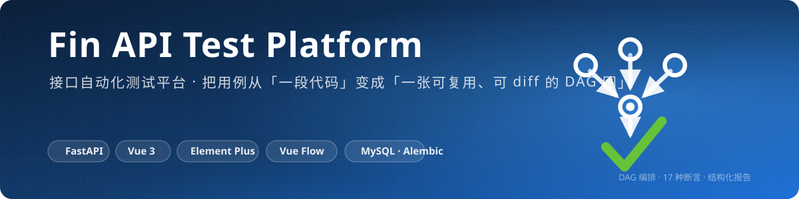

<p align="center">
  
</p>

# Fin API Test Platform

> 把用例从"一段代码"变成"一张可复用、可 diff 的 DAG 图"。

[](https://fastapi.tiangolo.com/)
[](https://vuejs.org/)
[](https://element-plus.org/)
[](https://vueflow.dev/)
[](#testing)
[](../LICENSE)

## Features

- **DAG 可视化编排** — 拖拽节点 + 连线描述执行顺序，自动布局 / 新节点防重叠 / minimap
- **字段级接口配置** — 字段表维护请求体（key、类型、默认值、必填），告别手写 JSON
- **多格式导入** — cURL / HAR / Swagger 2.0 / OpenAPI 3.0 一键导入接口与字段
- **表达式引擎** — `${now()}` `${random_int()}` `${uuid()}` 等 12 个内置函数 + `${context.xxx}` 变量引用 + `db.query()` 内联 SQL 查询
- **测试套件** — 跨系统用例链：`case_type='suite'` 串行执行多个成员用例（可跨项目、逐成员绑环境），共享变量白名单把上游变量池快照注入下游（环境变量 < 数据行 < 套件共享值），逐行配对 / 上游失败下游阻断 / 套件级汇总通知与专属报告
- **17 种断言** — JSONPath / 状态码 / 耗时 / DB 查询 / DB 与响应交叉校验，DB 断言支持重试应对异步落库
- **结构化报告** — 每步请求/响应/断言全量落库，后端导出 CSV（Excel 兼容）/ HTML（可打印 PDF）+ 耗时趋势图
- **文件中心** — 分类树 + 标签 + multipart 上传，`file` 字段直接引用文件中心资源
- **工程化** — JWT 鉴权 + admin/member 角色 + 操作审计 + Alembic 迁移 + 亮暗主题 + 标签页 + 命令面板（Ctrl+K）

## Quick Start

```bash
# 1. 建库
mysql -u root -p -e "CREATE DATABASE fin_api_test DEFAULT CHARSET utf8mb4"

# 2. 配置后端
cd platform/backend
cp .env.example .env   # 填写 DB_PASSWORD 与 JWT_SECRET_KEY
pip install -r requirements.txt
python -m uvicorn app.main:app --port 8000   # 自动迁移建表 + 创建 admin 账号

# 3. 启动前端
cd platform/frontend
npm install && npm run dev
```

访问 http://localhost:5173 · 默认账号 `admin` / `admin123`（首登强制改密）· Swagger http://127.0.0.1:8000/docs

## Architecture

```
┌─────────────────────────────────────────────────┐
│        前端 Vue3 + Element Plus + Vue Flow        │
│  views (20 页) ← composables                      │
│  useGroupedTable / useGroupMasterDetail           │
│  useExecutionRunner / useGroupTree                │
│       │                    ↑ 复用分组/拖拽/轮询    │
│       │ api/index.ts ← types/api.gen.ts (OpenAPI) │
└──────────────────────────┬──────────────────────┘
                           │ /api
┌──────────────────────────▼──────────────────────┐
│                 路由层 routers/                   │
│  HTTP 语义 + 鉴权 + 审计日志（薄层，无业务逻辑）      │
├─────────────────────────────────────────────────┤
│       数据访问层 crud/（按域拆分，显式 re-export）   │
│  users · auth · executions · datasets            │
│  versions · legacy（兼容期）                      │
├─────────────────────────────────────────────────┤
│                 服务层 services/                   │
│  execution_launcher · runtime · request_sender   │
│  body_builder · dataset_service · scheduler      │
│  suite_executor · spec_parser · report_export    │
│  notifier · files                                │
└──────────────────────────┬──────────────────────┘
                           │ 线程池异步执行
┌──────────────────────────▼──────────────────────┐
│              DAG 执行引擎 engine/                  │
│  topo_order 唯一实现 → prepare_request 统一组装    │
│  → 前置处理 → 请求 → 提取 → 断言                   │
│  events.py: StepResult → ExecutionSink 接缝       │
│  （事件产出与落库解耦，主链路可脱离 DB 测试）          │
└──────────────────────────┬──────────────────────┘
                ┌─────────┴─────────┐
                ▼                   ▼
          HTTP Client          MySQL Client
          401 自动重登          落库数据校验
```

**分层规约**（由测试守卫）：

- 路由层不内联 ORM，业务不变量下沉 `crud/` 域模块（如登录锁定策略在 `crud/auth.py`）
- 单次 HTTP 请求（GET/POST/multipart + 异常四分类）只有一份实现 `services/request_sender.py`，
  执行引擎与单接口调试共用
- 执行编排（数据集展开→建记录→提交→聚合通知）只有一份实现 `services/execution_launcher.py`，
  单次/批量/定时三入口共用；`runner.submit_batch_execution` 收 `list[ExecutionSpec]`
- 请求组装（"行值 > set_field > 默认值"三级优先级）单点 `engine/prepare_request.py`；
  Kahn 拓扑排序单点 `engine/topo.py`（执行序与数据集列序共用）；企微通知门控单点 `services/notifier.py`
- 执行引擎产出 `StepResult` 事件经 `ExecutionSink` 落库（`DbSink`），
  引擎不反向 import 路由层 —— `test_engine_does_not_import_routers` 守卫
- 报告导出为后端纯函数 `services/report_export.py`，`GET /reports/executions/{id}/export?format=csv|html`

## 前后端类型单一事实来源

后端 Pydantic schema 经 `scripts/export_openapi.py` 导出 OpenAPI JSON，
前端生成 TS 类型消费（含全部 Out 契约，字段漂移在编译期暴露）：

```bash
npm run gen:api    # platform/frontend 下执行：导出 schema → 生成 src/types/api.gen.ts
```

审计字段（created/updated × by/name）由 `schemas.AuditMixin` 单一声明，7 个 Out schema 继承。
响应类型优先取生成物别名（User/Project/ApiGroup/CaseGroup/OperationLog/FieldDictionary/
FileCategory/TestFile 等）；嵌套结构生成物退化为 unknown 的与承载领域 union 的仍手写，
原因注明在 `api/index.ts` 类型段头部。错误契约显式化：拦截器把一切失败规整为导出的
`ApiError`（message 必为后端 detail），视图 catch 只读 `e.message`。

## Testing

```bash
cd platform/backend
python -m pytest tests/ -q          # 676 passed
python -m ruff check --select F platform/backend   # 与 CI backend-lint 同口径
cd ../frontend && npx vue-tsc --noEmit             # 与 CI frontend-lint 同口径
```

测试布局（fake-db 单测，不依赖真实 MySQL）：

| 域 | 文件 | 覆盖 |
|---|---|---|
| 执行编排 | `test_execution_launcher.py` | 展开→提交→聚合编排 + ExecutionSpec 组装 |
| 执行引擎 | `test_execute_node.py` | 单节点管线 + 分层守卫 |
| 请求组装 | `test_prepare_request.py` | 三级取值优先级与组装顺序（11 用例） |
| 请求发送 | `test_request_sender.py` | 分发/multipart/异常分类 + 防平行实现守卫 |
| 通知 | `test_notifier.py` | 门控开关/单条与聚合通知/环境查无 |
| 拓扑排序 | `test_dag_executor_topo.py` | Kahn 排序唯一实现（执行/数据集共用） |
| 测试套件 | `test_suite_executor.py` | 白名单注入/逐行配对/行与整体阻断/嵌套与悬空（10 用例） |
| 变量合并 | `test_variable_merge.py` | 变量池优先级（环境变量 < 数据行 < 套件共享值） |
| crud 域 | `test_{users,auth,executions}_domain.py` | 登录锁定/首管理员/最后管理员保护等 |
| 数据驱动 | `test_{dataset_generate,dataset_service,row_override,execution_expand}.py` | 参数收集/快照保真过滤/三级优先级/行展开 |
| 报告导出 | `test_report_export.py` | CSV/HTML 契约 |
| schema | `test_audit_mixin.py` | 审计字段继承 + Out 契约 |

## Expression & Assertion

```yaml
# 字段默认值、set_field、断言 expected 均可用表达式
order_id: ${random_int(min=1, max=999999)}
bl_no: ${generate_bl_no(prefix='smoke')}
sign: ${md5(s='${context.token}_${timestamp()}')}

# 断言示例：DB 值 = 响应 JSONPath 取值（交叉校验，支持重试）
- type: db_vs_jsonpath_equals
  sql: "SELECT status FROM sys_order WHERE bl_no=${bl_no}"
  path: $.data.status
  retry_count: 3
  retry_interval: 2
```

完整 12 函数清单与 17 断言类型详见 [Swagger 文档](http://127.0.0.1:8000/docs) 与 `app/engine/`。

## Tech Stack

**后端** · FastAPI · SQLAlchemy 2.0 · Pydantic 2 · Alembic · jsonpath-ng · PyMySQL

**前端** · Vue 3.5 · Element Plus · Vue Flow · Vue Router · Pinia · Vite · openapi-typescript

## FAQ

- **uvicorn 无 access log** — `alembic/env.py` 的 `fileConfig()` 需设 `disable_existing_loggers=False`
- **路由切换后页面空白** — 顶层 `<router-view>` 不可加 `:key="route.path"`，会触发 MainLayout 重挂载丢状态

## License

[MIT](../LICENSE)
